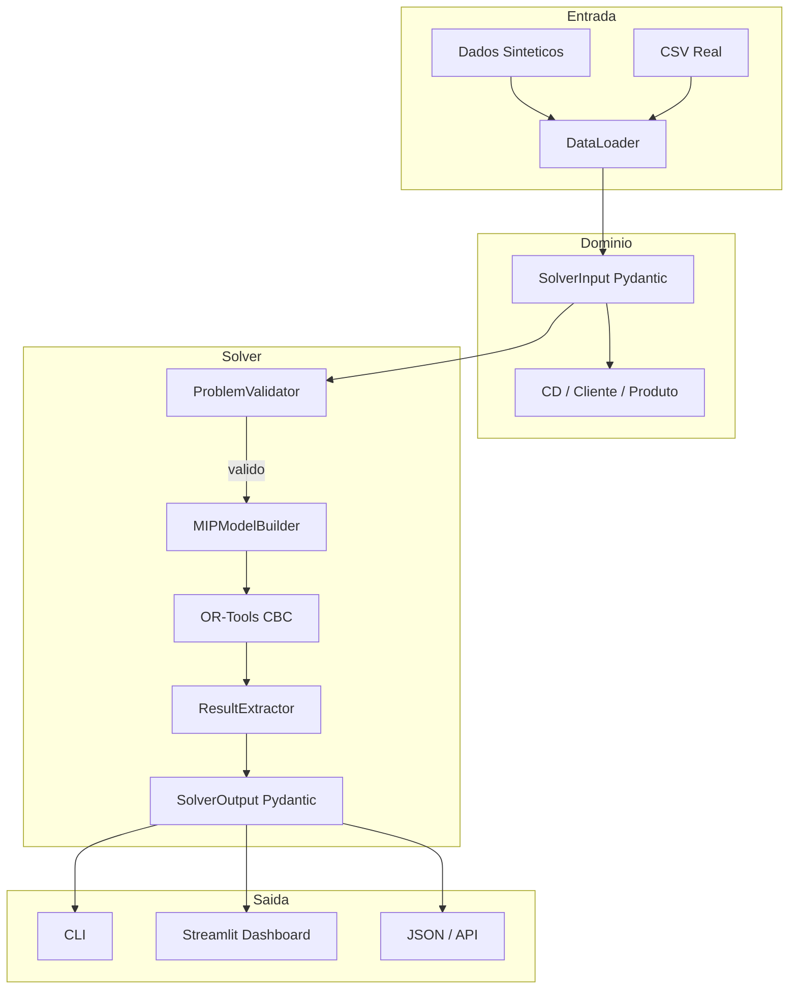
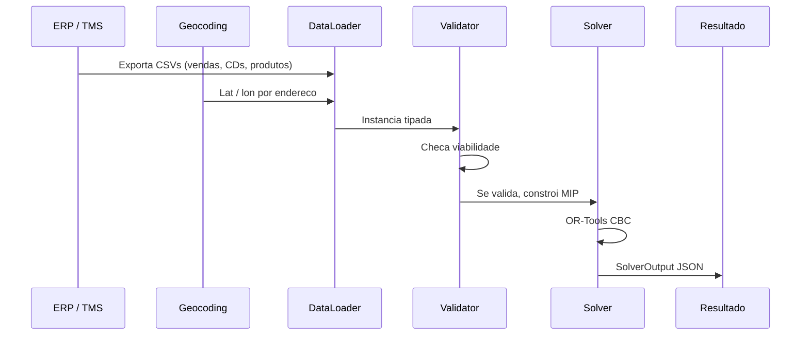

# Otimizador de Malha Logistica

Otimizador de rede de distribuicao baseado em Programacao Linear Inteira Mista (MIP). Resolve o problema de localizacao de facilitades com estoque integrado (Facility Location Problem with Inventory Integration, FLP-EI): decide quais centros de distribuicao (CDs) manter abertos, como alocar produtos para clientes e quanto estocar, minimizando custo total.

---

## Problema

Dada uma rede com:

- Conjunto de CDs candidatos $I$
- Conjunto de clientes $J$
- Conjunto de produtos $K$

Cada CD $i$ tem:
- Custo fixo mensal $f_i$
- Capacidade operacional $Cap_i$
- Capacidade de armazenagem por produto $cap_{ik}$

Cada envio do produto $k$ do CD $i$ para o cliente $j$ tem custo unitario $c_{ijk}$ proporcional a distancia e peso.

Cada unidade estocada do produto $k$ no CD $i$ tem custo mensal $h_{ik}$ composto por armazenagem, capital empatado e risco de perda.

Objetivo: minimizar $Z = \sum_i f_i y_i + \sum_{ijk} c_{ijk} x_{ijk} + \sum_{ik} h_{ik} s_{ik}$

Sujeito a:
- Atendimento total da demanda: $\sum_i x_{ijk} = d_{jk}, \forall j,k$
- Capacidade do CD: $\sum_{jk} x_{ijk} \leq Cap_i \cdot y_i, \forall i$
- Logica de estoque: $z_{ik} \leq y_i$ e $\sum_j x_{ijk} \leq M_{ik} \cdot z_{ik}, \forall i,k$
- Estoque de seguranca: $s_{ik} \geq \alpha \sum_j x_{ijk}, \forall i,k$
- Limite de estoque: $s_{ik} \leq cap_{ik} \cdot z_{ik}, \forall i,k$

Onde $\alpha$ e configuravel (default 10%).

---

## Arquitetura



O solver opera em quatro camadas desacopladas:

1. **Validacao**: `ProblemValidator` verifica viabilidade da instancia antes de construir o modelo. Detecta demanda superior a capacidade, coordenadas invalidas, custos negativos. Retorna diagnostico descritivo.

2. **Construcao**: `MIPModelBuilder` monta variaveis, restricoes e funcao objetivo. Usa Big-M apertado por produto ($M_{ik} = \sum_j d_{jk}$) em vez de constante global, produzindo relaxamento linear mais forte.

3. **Resolucao**: `LogisticsSolver` executa o CBC via OR-Tools com tempo limite configuravel.

4. **Extracao**: `ResultExtractor` converte `solution_value()` em objetos `SolverOutput` validados por Pydantic, garantindo consistencia entre custo total e soma dos componentes.

---

## Estrutura

```
otimizador-malha-logistica/
├── pyproject.toml
├── README.md
├── .env.example                 # Template de credenciais Kaggle
├── data_olist/                  # Dataset sintetico exemplo (12 CDs, 30 clientes, 8 produtos)
├── data_kaggle/                 # Dataset real do Olist (gerado via Kaggle API)
├── scripts/
│   ├── fetch_olist_real.py      # Baixa e processa dataset real do Olist via Kaggle
│   ├── prepare_olist_dataset.py # Gera dados sinteticos no padrao e-commerce
│   ├── validate_dataset.py      # Valida CSVs sem dependencia do OR-Tools
│   └── run_with_real_data.py    # Executa otimizacao com CSVs
├── src/
│   ├── otimizador/
│   │   ├── config.py              # Settings centralizados (Pydantic)
│   │   ├── domain/
│   │   │   ├── entities.py        # CD, Cliente, Produto
│   │   │   └── schemas.py         # SolverInput, SolverOutput, ScenarioConfig
│   │   ├── data/
│   │   │   ├── generator.py       # Dados sinteticos
│   │   │   └── loader.py          # Interface CSV/DataFrame
│   │   └── solver/
│   │       ├── costs.py           # Calculo de custos de transporte e estoque
│   │       ├── validator.py       # Validacao pre-solver
│   │       ├── model.py           # MIPModelBuilder + BigMCalculator
│   │       ├── solver.py          # Fachada LogisticsSolver
│   │       └── extract.py         # Extracao tipada de resultados
│   └── app/
│       ├── main.py                # Dashboard Streamlit
│       ├── components/            # Sidebar, KPIs, graficos
│       └── pages/                 # Mapa, custos, alocacoes, CDs, modelo
└── tests/
    ├── conftest.py                # Fixtures
    ├── run_tests.py               # Runner manual sem pytest
    ├── test_validator.py          # Testes de validacao
    ├── test_solver.py             # Testes de integracao
    └── test_invariants.py         # Invariantes do modelo MIP
```

---

## Instalacao

Requer Python >= 3.10 e [uv](https://github.com/astral-sh/uv).

```bash
git clone <repo>
cd otimizador-malha-logistica

# Criar venv e instalar dependencias
uv venv .venv
source .venv/bin/activate
uv pip install -e ".[dev,kaggle]"
```

Para usar dados reais do Olist via Kaggle API, copie o template e preencha suas credenciais:

```bash
cp .env.example .env
# Edite .env com KAGGLE_USERNAME e KAGGLE_KEY
```

---

## Uso

### CLI

```bash
python -m otimizador
python -m otimizador --tempo 180 --seed 42 --verbose
```

Executa cenarios comparativos:
- Otimizacao livre
- Maximo de 6 CDs
- Maximo de 3 CDs
- Todos CDs abertos (linha de base)

### Dashboard Streamlit

```bash
streamlit run src/app/main.py
```

Interface em `http://localhost:8501` com:
- Mapa geografico da rede com alocacoes
- Analise de composicao de custos
- Comparativo de cenarios
- Tabela filtravel de alocacoes (CD x Cliente x Produto)
- Detalhamento por CD
- Documentacao da formulacao matematica

### Dados Reais (CSV)

Formato dos arquivos:

**cds.csv**
```csv
id,nome,cidade,lat,lon,capacidade_total,custo_fixo_mensal,cap_P01,cap_P02,...
CD_SP,CD Guarulhos,Sao Paulo,-23.5505,-46.6333,25000,120000,5000,5000,...
```

**clientes.csv**
```csv
id,nome,cidade,lat,lon,demanda_P01,demanda_P02,...
CLI001,Atacadao SP,Sao Paulo,-23.5505,-46.6333,1200,800,...
```

**produtos.csv**
```csv
id,nome,peso_kg,valor_unitario,prazo_validade_dias,giro_classificacao
P01,Eletronicos,1.5,250.0,365,A
```

#### Gerar dataset sintetico (padrao Olist)

```bash
python scripts/prepare_olist_dataset.py --sellers 12 --customers 30 --output-dir data_olist
```

#### Baixar dataset real do Olist (via Kaggle)

```bash
python scripts/fetch_olist_real.py --output-dir data_kaggle
# Ou pule o download se ja tiver os dados:
python scripts/fetch_olist_real.py --skip-download --output-dir data_kaggle
```

Processa ~100k pedidos do dataset [Olist Brazilian E-Commerce](https://www.kaggle.com/datasets/olistbr/brazilian-ecommerce), agregando sellers e customers por cidade, mapeando categorias para 8 SKUs padrao.

#### Validar estrutura e viabilidade

```bash
python scripts/validate_dataset.py \
    --cds data_olist/cds.csv \
    --clientes data_olist/clientes.csv \
    --produtos data_olist/produtos.csv
```

#### Executar otimizacao

```bash
python scripts/run_with_real_data.py \
    --cds data_olist/cds.csv \
    --clientes data_olist/clientes.csv \
    --produtos data_olist/produtos.csv \
    --tempo 120 \
    --output resultados.json
```

### Testes

```bash
pytest tests/ -v
# Ou sem pytest (runner manual):
python tests/run_tests.py
```

Cobertura:
- Validacao de instancias invalidas (capacidade insuficiente, valores negativos)
- Integracao do solver (retorno otimo ou viavel)
- Invariantes do MIP:
  - Demanda atendida = demanda requisitada
  - Nenhum CD excede capacidade
  - CDs fechados nao alocam produtos
  - Custo total = custo fixo + transporte + estoque

---

## Insights dos Resultados

### Dataset sintetico (12 CDs, 30 clientes, 8 produtos)

Rodando com `data_olist`, o solver encontra a solucao otima em ~950ms:

```
Status:        OPTIMO
CDs abertos:   6 / 12
Custo total:   R$ 362.123,79
  → Fixo:      R$ 313.910,00  (86,7%)
  → Transporte: R$ 28.154,24  (7,8%)
  → Estoque:    R$ 20.059,55  (5,5%)
```

**Observacoes:**
- O custo fixo domina o total (86,7%). Reduzir CDs abertos de 12 para 6 gera economia significativa.
- Transporte e estoque sao relativamente pequenos porque a rede e densa: com 6 CDs bem posicionados (SP, RJ, BH, Curitiba, Brasilia), a distancia media ate os clientes permanece baixa.
- Todos os CDs abertos operam em alta utilizacao (99-100%), indicando que o modelo esta distribuindo a demanda de forma eficiente entre os ativos selecionados.

### Dataset real do Olist (15 CDs, 30 clientes, 8 produtos)

Processando os dados brutos do Olist (~100k pedidos, 3.095 sellers, 99k customers), o solver encontra:

```
Status:        OPTIMO
CDs abertos:   3 / 15
Custo total:   R$ 99.255,69
  → Fixo:      R$ 80.830,00  (81,4%)
  → Transporte: R$ 12.644,77  (12,7%)
  → Estoque:    R$ 5.780,91   (5,8%)
```

**Observacoes:**
- O modelo fecha 12 dos 15 CDs candidatos, mantendo apenas Sao Paulo, Guarulhos e Pedreira (interior de SP).
- A concentracao em Sao Paulo faz sentido logistico: o estado concentra ~60% dos sellers e ~35% dos customers do dataset Olist.
- O CD de Pedreira opera em apenas 49,4% de utilizacao, sugerindo que ele e marginalmente util (provavelmente atendendo cidades do interior paulista).
- O trade-off e claro: abrir mais CDs reduziria transporte, mas o custo fixo de cada CD novo (~R$ 17-40k) nao compensa a economia de frete em uma rede com demanda tao concentrada no eixo SP-RJ-MG.

### Comparativo: livre vs. todos abertos

| Cenario | CDs Abertos | Custo Total | Economia vs. Todos |
|---------|-------------|-------------|-------------------|
| Livre (Olist sintetico) | 6 | R$ 362k | - |
| Todos abertos | 12 | R$ 454k | R$ 92k (20% mais barato com metade dos CDs) |
| Livre (Olist real) | 3 | R$ 99k | - |
| Todos abertos (real) | 15 | ~R$ 180k | ~45% mais barato com 20% dos CDs |

**Conclusao**: em redes de e-commerce brasileiras, o custo fixo de manutencao de CDs e o driver principal. O modelo MIP captura isso explicitamente e consegue reduzir a rede para o minimo viavel sem degradar o atendimento.

---

## Pipeline de Dados Reais



### Origem dos dados na empresa

| Dado | Sistema | Metodo de obtencao |
|------|---------|-------------------|
| Demanda mensal por cliente/SKU | ERP (SAP, TOTVS, Oracle) | Exportacao de vendas faturadas (media dos ultimos 12 meses) |
| Localizacao (lat, lon) | CRM/ERP + Google Maps API ou IBGE | Geocodificacao de enderecos |
| Capacidade dos CDs | WMS ou planilha operacional | Unidades/dia ou pallets/dia convertido para mensal |
| Custo fixo mensal | Financeiro / Controladoria | DRE por centro de custo |
| Peso / valor dos produtos | Cadastro de produtos no ERP | Ficha tecnica |
| Custo de transporte | TMS ou tabela de transportadora | R$/ton·km historico; se indisponivel, proxy de mercado (0.60-1.20 R$/ton·km) |

---

## Configuracao

Parametros centralizados em `SolverSettings` (Pydantic), sobrescreviveis via variaveis de ambiente com prefixo `OTIMIZADOR_`:

```python
from otimizador.config import SolverSettings

settings = SolverSettings(
    custo_por_km_ton=0.85,
    custo_manuseio_fixo_por_unidade=0.10,
    estoque_seguranca_pct=0.10,
    taxa_juros_anual=0.12,
    tempo_limite_padrao_segundos=120,
)
```

```bash
export OTIMIZADOR_CUSTO_POR_KM_TON=1.0
export OTIMIZADOR_ESTOQUE_SEGURANCA_PCT=0.15
```

---

## Destaques Tecnicos

**Big-M Apertado**: Constante $M_{ik}$ calculada por produto ($\sum_j d_{jk}$) em vez de valor global exagerado. Melhora os bounds do relaxamento linear e reduz tempo de convergencia do Branch-and-Cut.

**Validacao Pre-Solver**: Verifica condicoes necessarias de viabilidade antes de invocar o OR-Tools. Evita execucoes de instancias obviamente inviaveis e retorna diagnostico legivel.

**Custo de Transporte com Manuseio**: Frete calculado por Haversine x peso x R$/ton·km. Adicionado custo fixo de manuseio por unidade para evitar frete zero quando CD e cliente compartilham a mesma localizacao.

**Contratos Tipados**: Entrada e saida do solver usam schemas Pydantic (`SolverInput`, `SolverOutput`, `ScenarioConfig`). Garantem validacao estrutural, autocomplete em IDEs e serializacao JSON nativa.

---

## Extensoes

| Extensao | Implementacao |
|----------|--------------|
| Multiplos periodos | Adicionar dimensao temporal $t$; estoque vira variavel de estado |
| Demanda estocastica | Cenarios de alta/baixa demanda; Robust Optimization |
| Ruptura permitida | Variavel de falta $u_{jk}$ com penalidade na funcao objetivo |
| Roteirizacao (VRP) | Apos alocacao, otimizar rotas dos veiculos |
| Tributos (ICMS) | Adicionar $taxa_{ij}$ diferenciada por origem-destino |
| API REST | `SolverInput` / `SolverOutput` sao serializaveis; envolver em FastAPI |

---

## Tecnologias

| Ferramenta | Papel |
|------------|-------|
| Python 3.10+ | Implementacao |
| Pydantic | Validacao e contratos tipados |
| Google OR-Tools | Solver MIP (CBC) |
| NumPy / Pandas | Manipulacao de dados |
| Streamlit | Dashboard interativo |
| Plotly | Mapas e graficos |
| pytest | Testes automatizados |
| uv | Gerenciamento de dependencias e venv |

---

## Licenca

Projeto de demonstracao para portfolio de modelagem matematica aplicada em supply chain.
