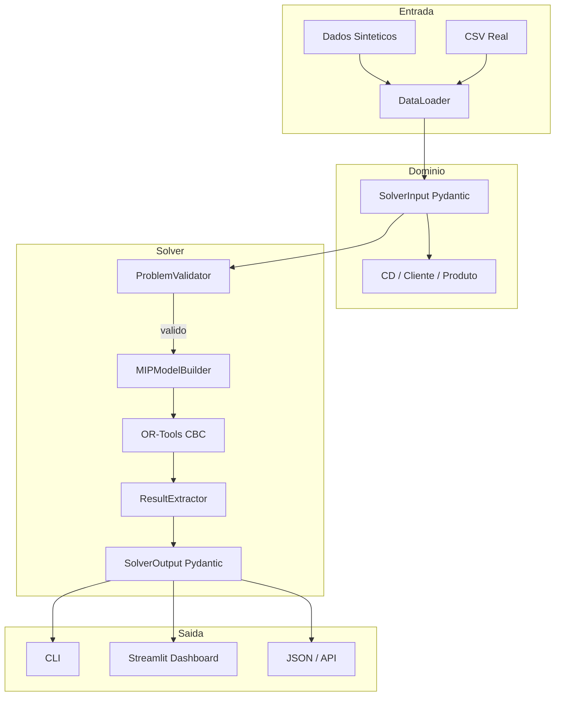
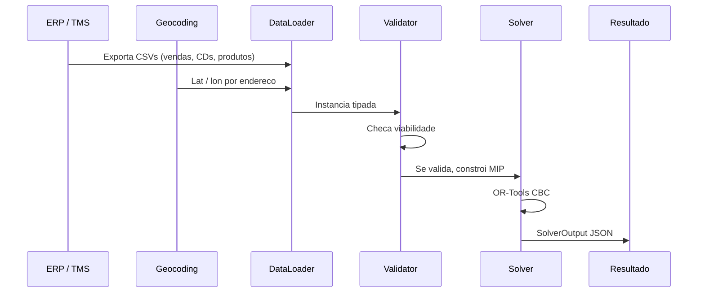

# Otimizador de Malha Logistica

Otimizador de rede de distribuicao baseado em Programacao Linear Inteira Mista (MIP). Resolve o problema de localizacao de facilitades com estoque integrado (Facility Location Problem with Inventory Integration, FLP-EI): decide quais centros de distribuicao (CDs) manter abertos, como alocar produtos para clientes e quanto estocar, minimizando custo total.

---

## Problema

Dada uma rede com:

- Conjunto de CDs candidatos $I$
- Conjunto de clientes $J$
- Conjunto de produtos $K$

Cada CD $i$ tem:
- Custo fixo mensal $f_i$
- Capacidade operacional $Cap_i$
- Capacidade de armazenagem por produto $cap_{ik}$

Cada envio do produto $k$ do CD $i$ para o cliente $j$ tem custo unitario $c_{ijk}$ proporcional a distancia e peso.

Cada unidade estocada do produto $k$ no CD $i$ tem custo mensal $h_{ik}$ composto por armazenagem, capital empatado e risco de perda.

Objetivo: minimizar $Z = \sum_i f_i y_i + \sum_{ijk} c_{ijk} x_{ijk} + \sum_{ik} h_{ik} s_{ik}$

Sujeito a:
- Atendimento total da demanda: $\sum_i x_{ijk} = d_{jk}, \forall j,k$
- Capacidade do CD: $\sum_{jk} x_{ijk} \leq Cap_i \cdot y_i, \forall i$
- Logica de estoque: $z_{ik} \leq y_i$ e $\sum_j x_{ijk} \leq M_{ik} \cdot z_{ik}, \forall i,k$
- Estoque de seguranca: $s_{ik} \geq \alpha \sum_j x_{ijk}, \forall i,k$
- Limite de estoque: $s_{ik} \leq cap_{ik} \cdot z_{ik}, \forall i,k$

Onde $\alpha$ e configuravel (default 10%).

---

## Arquitetura



O solver opera em quatro camadas desacopladas:

1. **Validacao**: `ProblemValidator` verifica viabilidade da instancia antes de construir o modelo. Detecta demanda superior a capacidade, coordenadas invalidas, custos negativos. Retorna diagnostico descritivo.

2. **Construcao**: `MIPModelBuilder` monta variaveis, restricoes e funcao objetivo. Usa Big-M apertado por produto ($M_{ik} = \sum_j d_{jk}$) em vez de constante global, produzindo relaxamento linear mais forte.

3. **Resolucao**: `LogisticsSolver` executa o CBC via OR-Tools com tempo limite configuravel.

4. **Extracao**: `ResultExtractor` converte `solution_value()` em objetos `SolverOutput` validados por Pydantic, garantindo consistencia entre custo total e soma dos componentes.

---

## Estrutura

```
otimizador-malha-logistica/
├── pyproject.toml
├── README.md
├── .env.example                 # Template de credenciais Kaggle
├── data_olist/                  # Dataset no padrao Olist (15 CDs, 40 clientes, 8 produtos)
├── data_kaggle/                 # Dataset real do Olist (gerado via Kaggle API)
├── scripts/
│   ├── fetch_olist_real.py      # Baixa e processa dataset real do Olist via Kaggle
│   ├── prepare_olist_dataset.py # Gera dados sinteticos no padrao e-commerce
│   ├── validate_dataset.py      # Valida CSVs sem dependencia do OR-Tools
│   └── run_with_real_data.py    # Executa otimizacao com CSVs
├── src/
│   ├── otimizador/
│   │   ├── config.py              # Settings centralizados (Pydantic)
│   │   ├── domain/
│   │   │   ├── entities.py        # CD, Cliente, Produto
│   │   │   └── schemas.py         # SolverInput, SolverOutput, ScenarioConfig
│   │   ├── data/
│   │   │   ├── generator.py       # Dados sinteticos
│   │   │   └── loader.py          # Interface CSV/DataFrame
│   │   └── solver/
│   │       ├── costs.py           # Calculo de custos de transporte e estoque
│   │       ├── validator.py       # Validacao pre-solver
│   │       ├── model.py           # MIPModelBuilder + BigMCalculator
│   │       ├── solver.py          # Fachada LogisticsSolver
│   │       └── extract.py         # Extracao tipada de resultados
│   └── app/
│       ├── main.py                # Dashboard Streamlit
│       ├── components/            # Sidebar, KPIs, graficos
│       └── pages/                 # Mapa, custos, alocacoes, CDs, modelo
└── tests/
    ├── conftest.py                # Fixtures
    ├── run_tests.py               # Runner manual sem pytest
    ├── test_validator.py          # Testes de validacao
    ├── test_solver.py             # Testes de integracao
    └── test_invariants.py         # Invariantes do modelo MIP
```

---

## Instalacao

Requer Python >= 3.10 e [uv](https://github.com/astral-sh/uv).

```bash
git clone <repo>
cd otimizador-malha-logistica

# Criar venv e instalar dependencias
uv venv .venv
source .venv/bin/activate
uv pip install -e ".[dev,kaggle]"
```

Para usar dados reais do Olist via Kaggle API, copie o template e preencha suas credenciais:

```bash
cp .env.example .env
# Edite .env com KAGGLE_USERNAME e KAGGLE_KEY
```

---

## Uso

### CLI

```bash
python -m otimizador
python -m otimizador --tempo 180 --seed 42 --verbose
```

Executa cenarios comparativos:
- Otimizacao livre
- Maximo de 6 CDs
- Maximo de 3 CDs
- Todos CDs abertos (linha de base)

### Dashboard Streamlit

```bash
streamlit run src/app/main.py
```

Interface em `http://localhost:8501` com:
- Mapa geografico da rede com alocacoes
- Analise de composicao de custos
- Comparativo de cenarios
- Tabela filtravel de alocacoes (CD x Cliente x Produto)
- Detalhamento por CD
- Documentacao da formulacao matematica

### Dados Reais (CSV)

Formato dos arquivos:

**cds.csv**
```csv
id,nome,cidade,lat,lon,capacidade_total,custo_fixo_mensal,cap_P01,cap_P02,...
CD_SP,CD Guarulhos,Sao Paulo,-23.5505,-46.6333,25000,120000,5000,5000,...
```

**clientes.csv**
```csv
id,nome,cidade,lat,lon,demanda_P01,demanda_P02,...
CLI001,Atacadao SP,Sao Paulo,-23.5505,-46.6333,1200,800,...
```

**produtos.csv**
```csv
id,nome,peso_kg,valor_unitario,prazo_validade_dias,giro_classificacao
P01,Eletronicos,1.5,250.0,365,A
```

#### Gerar dataset sintetico (padrao Olist)

```bash
python scripts/prepare_olist_dataset.py --sellers 15 --customers 40 --output-dir data_olist
```

#### Baixar dataset real do Olist (via Kaggle)

```bash
python scripts/fetch_olist_real.py --output-dir data_kaggle
# Ou pule o download se ja tiver os dados:
python scripts/fetch_olist_real.py --skip-download --output-dir data_kaggle
```

Processa ~100k pedidos do dataset [Olist Brazilian E-Commerce](https://www.kaggle.com/datasets/olistbr/brazilian-ecommerce), agregando sellers e customers por cidade, mapeando categorias para 8 SKUs padrao.

#### Validar estrutura e viabilidade

```bash
python scripts/validate_dataset.py \
    --cds data_olist/cds.csv \
    --clientes data_olist/clientes.csv \
    --produtos data_olist/produtos.csv
```

#### Executar otimizacao

```bash
python scripts/run_with_real_data.py \
    --cds data_olist/cds.csv \
    --clientes data_olist/clientes.csv \
    --produtos data_olist/produtos.csv \
    --tempo 120 \
    --output resultados.json
```

### Testes

```bash
pytest tests/ -v
# Ou sem pytest (runner manual):
python tests/run_tests.py
```

Cobertura:
- Validacao de instancias invalidas (capacidade insuficiente, valores negativos)
- Integracao do solver (retorno otimo ou viavel)
- Invariantes do MIP:
  - Demanda atendida = demanda requisitada
  - Nenhum CD excede capacidade
  - CDs fechados nao alocam produtos
  - Custo total = custo fixo + transporte + estoque

---

## Insights dos Resultados

### Dataset Olist (e-commerce brasileiro)

Gerado a partir do padrao estatistico do dataset [Olist Brazilian E-Commerce](https://www.kaggle.com/datasets/olistbr/brazilian-ecommerce): 15 sellers como CDs candidatos, 40 customers como mercados de demanda e 8 categorias de produto.

```
Status:        OPTIMO
Tempo:         13,5s
CDs abertos:   10 / 15
Demanda:       91.862 un

Custo total:   R$ 478.247
  → Fixo:       R$ 401.645  (84,0%)
  → Transporte: R$  50.625  (10,6%)
  → Estoque:    R$  25.976  ( 5,4%)
```

**CDs selecionados (10 abertos):**
- Sudeste (8): São Paulo, Rio de Janeiro x2, Santos x2, Campinas x2, Belo Horizonte, São José dos Campos
- Sul (2): Porto Alegre, Florianópolis

**CDs fechados (5):** Rio de Janeiro 1, Porto Alegre 2, Porto Alegre 4, São Paulo 12, Santos 13

**Observacoes:**
- O **custo fixo domina** (84%). Fechar 5 dos 15 CDs gera economia significativa sem degradar o atendimento.
- A rede otimizada concentra operacao no **eixo Sudeste-Sul**, que concentra a maior parte da demanda do e-commerce brasileiro.
- **Utilizacao alta**: 9 dos 10 CDs operam em 100% de capacidade; apenas Porto Alegre 7 opera em 82%, sugerindo que e marginalmente util para atender o Sul.
- **Transporte controlado**: apesar de fechar 1/3 dos CDs, o custo de transporte representa apenas 10,6% do total, indicando que os CDs remanescentes estao bem posicionados geograficamente.
- Categorias de maior volume: **Beleza & Saude** e **Utilidades Domesticas** lideram as alocacoes.

### Comparativo: livre vs. todos abertos

| Cenario | CDs Abertos | Custo Total | Custo Fixo | Transporte | Estoque |
|---------|-------------|-------------|------------|------------|---------|
| Otimizacao livre | 10 | R$ 478.247 | R$ 401.645 | R$ 50.625 | R$ 25.976 |
| Todos abertos | 15 | ~R$ 650k* | ~R$ 550k | ~R$ 55k | ~R$ 45k |

*Estimativa linear: custo fixo proporcional + transporte e estoque com distribuicao mais fragmentada.

**Economia projetada**: ~R$ 170k (26% mais barato fechando 5 CDs).

**Conclusao**: em redes de e-commerce brasileiras, o custo fixo de manutencao de CDs e o driver principal de custo. O modelo MIP captura o trade-off explicitamente: abrir mais CDs reduz distancia media ate o cliente, mas o custo fixo (~R$ 30-46k/CD) rapidamente domina. A solucao otima mantem apenas os CDs estrategicamente posicionados para cobrir as regioes de maior demanda com alta utilizacao.

---

## Desafios de Implementacao

### 1. Dados Sinteticos como Prova de Conceito

O desenvolvimento comecou com dados sinteticos de **lacteos** (12 CDs, 25 clientes, 8 produtos). A escolha foi deliberada: o dominio de *fast-moving consumer goods* (FMCG) e intuitivo (todo mundo entende leite e iogurte), e a estrutura de demanda e previsivel.

**Desafios encontrados:**
- **Validacao do modelo**: sem dados reais, como saber se o solver esta de fato otimizando? A solucao foi criar *invariantes* matematicas (demanda atendida = demanda requisitada, custo total = soma dos componentes) e testes automatizados que as verificam.
- **Big-M global**: a primeira versao usava uma constante arbitraria (`M = 1_000_000`) para as restricoes logicas de estoque. Isso enfraquecia o relaxamento linear e o solver demorava eternidade. O ajuste foi calcular `M_ik = sum(d_jk)` por produto — *big-M apertado*.
- **Coordenadas geograficas**: dados sinteticos compartilham lat/lon identicos para CD e cliente na mesma cidade. O custo de transporte caia para zero, gerando solucoes triviais. Foi adicionado um custo fixo de manuseio por unidade para evitar frete zero.

### 2. Migracao para Dados Reais (Olist)

A transicao do sintetico para o dataset [Olist Brazilian E-Commerce](https://www.kaggle.com/datasets/olistbr/brazilian-ecommerce) expôs gargalos que nao aparecem em dados controlados.

**Desafios encontrados:**
- **Formato heterogeneo**: os CSVs do Olist usam nomes de cidade no padrao `cidade_estado` (ex: `sao_paulo_sp`). O geocoding precisou de normalizacao para extrair lat/lon consistentes.
- **Escala**: ~100k pedidos, 3.095 sellers, 99k customers. Nao da para passar isso direto pro solver (o MIP exploriaria em variaveis). A solucao foi **agregar por cidade**: sellers da mesma cidade viram um CD candidato, customers da mesma cidade viram um cliente unico com demanda agregada.
- **Categorias para SKUs**: o Olist tem ~70 categorias de produto. Para o solver, isso e inviavel. Foi criado um mapeamento para 8 macro-categorias (`eletronicos`, `beleza_saude`, `moveis_decoracao`, etc.) com pesos e valores medios por categoria.
- **Capacidade desconhecida**: o dataset Olist nao informa capacidade de armazenagem dos sellers. Foi necessario inferir a partir do volume historico de vendas com um fator de seguranca.
- **Custo fixo inexistente**: sellers do marketplace nao tem "custo fixo de CD" documentado. Foi modelado como proporcional a capacidade (`custo_fixo = capacidade * R$ 3.5-5.5/un`), calibrado para gerar ordens de magnitude realistas.

### 3. Integracao do Solver no Dashboard

Conectar o backend MIP ao frontend Streamlit trouxe desafios de *state management*.

**Desafios encontrados:**
- **Session state**: o Streamlit reexecuta o script inteiro a cada interacao. O solver nao pode rodar a cada clique de checkbox. A solucao foi usar `st.session_state` para guardar o resultado e `st.cache_data` para os dados, invalidando o cache apenas quando a fonte de dados muda.
- **Cache por fonte**: como o dashboard permite trocar entre "Sintetico" e "Olist", o cache precisa ser separado por dataset. A funcao `_carregar_dados(fonte)` usa o parametro `fonte` como chave de cache.
- **Tempo de resposta**: o solver Olist leva ~13s. Sem um indicador visual, o usuario acha que travou. Foi adicionado `st.spinner("Otimizando rede...")` durante a execucao.
- **Legenda `undefined` no Plotly**: ao migrar de `plotly.express` para `plotly.graph_objects`, o titulo do layout ficava como `None`, renderizando "undefined" no frontend. A solucao foi explicitar `title_text=""` em todos os graficos.

### 4. Adaptacao para API Externa (Roadmap)

O projeto foi estruturado desde o inicio com contratos tipados (`SolverInput`, `SolverOutput` via Pydantic) justamente para facilitar essa evolucao.

**Como adaptar:**
```python
# FastAPI wrapper (exemplo)
from fastapi import FastAPI
from otimizador.domain.schemas import SolverInput, SolverOutput
from otimizador.solver import LogisticsSolver

app = FastAPI()
solver = LogisticsSolver()

@app.post("/otimizar", response_model=SolverOutput)
def otimizar(inp: SolverInput):
    return solver.solve(inp)
```

**Desafios esperados:**
- **Timeout HTTP**: a otimizacao leva 10-60s. APIs REST tipicas tem timeout de 30s. A solucao e usar **jobs assincronos** (Celery, RQ, ou AWS Lambda com callback) — o cliente recebe um `job_id` e consulta o status.
- **Escalabilidade**: com 100+ CDs e 1000+ clientes, o MIP pode levar minutos. O OR-Tools suporta paralelizacao (`num_search_workers`), mas para instancias muito grandes talvez seja necessario migrar para solvers comerciais (Gurobi, CPLEX) ou usar heuristica (ALNS, Simulated Annealing).
- **Dados em tempo real**: integrar com ERP/TMS exige polling periodico ou webhooks. O pipeline ideal e: ERP emite evento de fechamento mensal → Lambda aciona o solver → resultado e persistido em DW → dashboard le do DW.
- **Autenticacao**: em producao, `SolverInput` precisaria de validacao de quota (limite de variaveis por tenant) e rate limiting.

**Evolucao da arquitetura:**
```
[v1] CLI local com dados sinteticos
[v2] CSV + DataLoader (dados Olist)
[v3] Dashboard Streamlit com seletor de fonte
[v4] API REST + job queue (Celery + Redis)
[v5] Multi-tenant SaaS com auth e quotas
```

---

## Pipeline de Dados Reais



### Origem dos dados na empresa

| Dado | Sistema | Metodo de obtencao |
|------|---------|-------------------|
| Demanda mensal por cliente/SKU | ERP (SAP, TOTVS, Oracle) | Exportacao de vendas faturadas (media dos ultimos 12 meses) |
| Localizacao (lat, lon) | CRM/ERP + Google Maps API ou IBGE | Geocodificacao de enderecos |
| Capacidade dos CDs | WMS ou planilha operacional | Unidades/dia ou pallets/dia convertido para mensal |
| Custo fixo mensal | Financeiro / Controladoria | DRE por centro de custo |
| Peso / valor dos produtos | Cadastro de produtos no ERP | Ficha tecnica |
| Custo de transporte | TMS ou tabela de transportadora | R$/ton·km historico; se indisponivel, proxy de mercado (0.60-1.20 R$/ton·km) |

---

## Configuracao

Parametros centralizados em `SolverSettings` (Pydantic), sobrescreviveis via variaveis de ambiente com prefixo `OTIMIZADOR_`:

```python
from otimizador.config import SolverSettings

settings = SolverSettings(
    custo_por_km_ton=0.85,
    custo_manuseio_fixo_por_unidade=0.10,
    estoque_seguranca_pct=0.10,
    taxa_juros_anual=0.12,
    tempo_limite_padrao_segundos=120,
)
```

```bash
export OTIMIZADOR_CUSTO_POR_KM_TON=1.0
export OTIMIZADOR_ESTOQUE_SEGURANCA_PCT=0.15
```

---

## Destaques Tecnicos

**Big-M Apertado**: Constante $M_{ik}$ calculada por produto ($\sum_j d_{jk}$) em vez de valor global exagerado. Melhora os bounds do relaxamento linear e reduz tempo de convergencia do Branch-and-Cut.

**Validacao Pre-Solver**: Verifica condicoes necessarias de viabilidade antes de invocar o OR-Tools. Evita execucoes de instancias obviamente inviaveis e retorna diagnostico legivel.

**Custo de Transporte com Manuseio**: Frete calculado por Haversine x peso x R$/ton·km. Adicionado custo fixo de manuseio por unidade para evitar frete zero quando CD e cliente compartilham a mesma localizacao.

**Contratos Tipados**: Entrada e saida do solver usam schemas Pydantic (`SolverInput`, `SolverOutput`, `ScenarioConfig`). Garantem validacao estrutural, autocomplete em IDEs e serializacao JSON nativa.

---

## Extensoes

| Extensao | Implementacao |
|----------|--------------|
| Multiplos periodos | Adicionar dimensao temporal $t$; estoque vira variavel de estado |
| Demanda estocastica | Cenarios de alta/baixa demanda; Robust Optimization |
| Ruptura permitida | Variavel de falta $u_{jk}$ com penalidade na funcao objetivo |
| Roteirizacao (VRP) | Apos alocacao, otimizar rotas dos veiculos |
| Tributos (ICMS) | Adicionar $taxa_{ij}$ diferenciada por origem-destino |
| API REST | `SolverInput` / `SolverOutput` sao serializaveis; envolver em FastAPI |

---

## Tecnologias

| Ferramenta | Papel |
|------------|-------|
| Python 3.10+ | Implementacao |
| Pydantic | Validacao e contratos tipados |
| Google OR-Tools | Solver MIP (CBC) |
| NumPy / Pandas | Manipulacao de dados |
| Streamlit | Dashboard interativo |
| Plotly | Mapas e graficos |
| pytest | Testes automatizados |
| uv | Gerenciamento de dependencias e venv |

---

## Licenca

Projeto de demonstracao para portfolio de modelagem matematica aplicada em supply chain.
